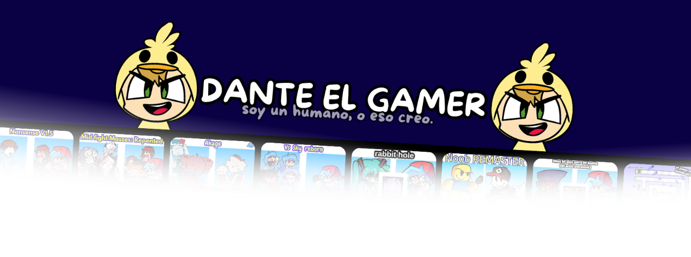

<h1 align="center">👋 Hey! Soy Dante el Gamer 🟡</h1>

🎮 Creador de contenido | 💻 Programador | 🕹️ Gamer  
✨ Amante de lo electrónico, suelo programar en JSON, HTML, TurboWarp, Roblox Studio (Lua), Haxe, Arduino y otros lenguajes curiosos 🧠⚡

---

### 🌐 Mis redes (sígueme 👇)

---

### 🧠 Sobre mí

💬 Soy un niño que ama programar ideas, crear mods de juegos y engines de *Friday Night Funkin’* 🕹️  
🎨 También hago contenido divertido para entretener y conectar con mi comunidad 💫  
⚡ Siempre buscando mejorar, aprender algo nuevo y romperla con estilo gamer 😎  

---

### ⚙️ Lenguajes y herramientas que uso

💻 Fedora Linux 🐧  
🛠️ JSON, HTML, Lua, Haxe, Arduino, CSS, JS  
🎮 TurboWarp, Roblox Studio, FNF Modding Tools, geodot, y más 

---

### 📊 Stats del bro 😎

  
  

---

✨ *Gracias por pasarte, master del código y la diversión 😎*  
🧩 *Nos vemos en el YouTube, el FNF o en charla en twich 🕹️*
